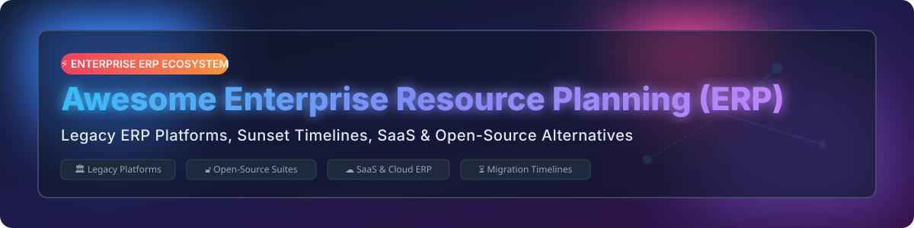

# 🚀 Awesome Enterprise Resource Planning (ERP) Legacy & Open-Source Guide 🏢

    

**Curated List of Legacy ERP Platforms, Cloud SaaS ERP Solutions & Open-Source Alternatives 📊**

*Focused on Enterprise Resource Planning (ERP) On-Premises Migration Paths, Sunset Timelines, Cloud SaaS Pricing, and Open-Source Suite Replacements* 🛠️

**Last updated: October 2026** 📅

---

## 💡 Overview & Market Dynamics 📈

This repository tracks notable **legacy ERP platforms**, **cloud SaaS ERP solutions**, and **open-source ERP alternatives** for organizations running traditional on-premises systems. These resources help enterprise architects, IT leaders, and sysadmins maintain existing installations, plan migrations before vendor sunset dates, or transition to modern SaaS and open-source platforms.

**Popular Legacy Platforms Include:** SAP R/3 / ECC, Microsoft Dynamics AX & GP, Oracle E-Business Suite, JD Edwards EnterpriseOne, PeopleSoft, Baan ERP, Sage Line 500, Lawson ERP, and SSA BPCS. 🏛️

---

## 📖 Table of Contents 📚

- [💡 Overview & Market Dynamics 📈](#-overview--market-dynamics-)
- [🏛️ Legacy On-Premises ERP Platforms](#️-legacy-on-premises-erp-platforms)
- [☁️ Cloud & SaaS ERP Products](#️-cloud--saas-erp-products)
- [🔓 Open-Source ERP Alternatives](#-open-source-erp-alternatives)
- [🤝 How to Contribute](#-how-to-contribute)
- [💖 Support & Sponsorship](#-support--sponsorship)
- [⭐ Star History](#-star-history)
- [⚠️ Disclaimer](#️-disclaimer)

---

## 🏛️ Legacy On-Premises ERP Platforms 🏛️

> **📊 Market Context & Sunset Timelines**: The legacy on-premises ERP market is **declining but persistent**. **SAP Business Suite 7** ends mainstream support on **December 31, 2027** (premium maintenance through end of 2030). **Microsoft Dynamics GP** ends **September 30, 2029** (security patches only through April 2031). **Oracle PeopleSoft** is committed to support at least through **2035** with a rolling 10-year guarantee. **Epicor** has set final on-premise release dates for Kinetic (2028.1), Prophet 21 (2028.1), and BisTrack (2028.1). Major vendors are actively sunsetting on-premises ERP to accelerate cloud migrations. ⏳

| Platform 🏢 | Description 📝 | Current Status ⏱️ | Migration Path 🔄 | Company Size / Revenue 💰 |
| :--- | :--- | :--- | :--- | :--- |
| **[Microsoft Dynamics AX](https://www.microsoft.com/en-us/dynamics-365)** | **Microsoft's legacy enterprise ERP.** Predecessor to Dynamics 365 Finance & Operations. | **Discontinued** — Dynamics AX 2012 support ended **Jan 2023**. | **Dynamics 365 Finance & Operations** (Cloud) | **~$281B Revenue** (Microsoft FY2025) |
| **[Microsoft Dynamics GP](https://www.microsoft.com/en-us/dynamics-365)** | **Microsoft's mid-market ERP (formerly Great Plains).** Long-standing SMB solution. | **End of support**: **Sept 30, 2029**. Security patches through **April 2031**. | **Dynamics 365 Business Central** (Cloud) | **~$281B Revenue** (Microsoft FY2025) |
| **[Oracle E-Business Suite](https://www.oracle.com/)** | **Oracle's flagship ERP.** Financials, SCM, HRMS, CRM across global enterprises. | **Premier Support**: Through **Dec 2030**. Extended support through **Dec 2033**. | **Oracle Fusion Cloud Applications** | **~$53B Revenue** (Oracle FY2025) |
| **[JD Edwards EnterpriseOne](https://www.oracle.com/)** | **Oracle's mid-market ERP (formerly PeopleSoft/JDE).** Strong in manufacturing & distribution. | **Premier Support**: Through **Dec 2030**. Extended support through **Dec 2033**. | **Oracle Fusion Cloud ERP** or **JDE on OCI** | **~$53B Revenue** (Oracle FY2025) |
| **[Oracle PeopleSoft](https://www.oracle.com/)** | **Oracle's HCM and Campus Solutions platform.** Popular in higher ed & public sector. | **Support commitment**: At least through **2035** with rolling 10-year guarantee. | **Oracle Fusion Cloud Applications** | **~$53B Revenue** (Oracle FY2025) |
| **[SAP R/3 / SAP Business Suite 7](https://www.sap.com/)** | **Enterprise ERP standard for 30+ years.** ECC, CRM, SRM, SCM modules powering global enterprises. | **Mainstream support ends**: **Dec 31, 2027**. Premium maintenance through **2030**. | **SAP S/4HANA Cloud / Private Edition** | **~$35B Revenue** (SAP FY2025) |
| **[Sage Line 500](https://www.sage.com/)** | **Sage's legacy UK mid-market ERP.** Widely used in distribution & light manufacturing. | **Legacy status** — Migrated customers to modern Sage lines. | **Sage 200** or **Sage X3** | **~$2.5B Revenue** (Sage FY2025) |
| **[Baan ERP](https://www.infor.com/)** | **Dutch manufacturing ERP (now Infor LN).** Manufacturing and supply chain focus. | **Legacy status** — Baan IV/5 are obsolete. Infor LN active. | **Infor LN CloudSuite** | **Private (~$3.2B est)** (Infor) |
| **[Lawson ERP](https://www.infor.com/)** | **Healthcare, retail & public sector enterprise ERP.** Acquired by Infor. | **Legacy status** — Migrated to cloud suite platforms. | **Infor CloudSuite** | **Private (~$3.2B est)** (Infor) |
| **[SSA BPCS](https://www.infor.com/)** | **Legacy ERP for manufacturing & distribution.** Acquired by Infor. | **Legacy status** — Migrated customers to Infor LX/CloudSuite. | **Infor LX** / **Infor CloudSuite Industrial** | **Private (~$3.2B est)** (Infor) |

---

## ☁️ Cloud & SaaS ERP Products ☁️

> **📊 Market Size & Structure**: The global Enterprise Resource Planning (ERP) software market size is estimated at **~$54 Billion - $65 Billion**, projected to grow beyond **$100 Billion** by 2030. The market is **moderately fragmented**: top tier-1 vendors (SAP, Oracle, Microsoft) hold dominant market share in large enterprises, while specialized SaaS providers (NetSuite, Workday, Acumatica, Odoo Cloud) compete aggressively across SMB and mid-market segments. 🌐

| Product 🏢 | Description 📝 | Specific Starting Price 💵 | Free Tier / Trial Limits ⏳ | Company Size / Revenue / Valuation 💰 |
| :--- | :--- | :--- | :--- | :--- |
| **[Microsoft Dynamics 365](https://dynamics.microsoft.com/)** | Cloud enterprise applications suite combining ERP & CRM capabilities. | **$50/user/month** (Business Central Essentials tier) | **30-day free trial** with pre-loaded sample data & standard user limits | **~$281B Revenue** (Microsoft FY2025) |
| **[Oracle Fusion Cloud ERP](https://www.oracle.com/erp/)** | Complete cloud financial and operational ERP suite for mid-market and enterprises. | **$625/hosted user/month** (Financials Cloud base license) | **30-day free trial** with $300 Oracle Cloud credits | **~$53B Revenue** (Oracle FY2025) |
| **[SAP S/4HANA Cloud](https://www.sap.com/products/erp/s4hana-cloud.html)** | Next-generation intelligent cloud ERP suite with embedded AI and analytics. | **$135/user/month** (GROW with SAP base user entry rate) | **14-day free trial** access to guided test environments | **~$35B Revenue** (SAP FY2025) |
| **[Workday Financial Management](https://www.workday.com/)** | Cloud-native financial management and enterprise planning suite for large organizations. | **~$100/user/month** (Estimated annual contract floor ~$45,000/yr) | **No free tier or public trial** (Interactive product tours available) | **~$8.4B Revenue** (Workday FY2025) |
| **[Oracle NetSuite](https://www.netsuite.com/)** | Scalable cloud ERP suite tailored for mid-market and growing businesses. | **$99/user/month** + **$999/month** base platform license fee | **No free tier**; custom product demo sandbox on request | **Part of Oracle (~$53B)** / ~$2.5B NetSuite unit |
| **[Infor CloudSuite](https://www.infor.com/)** | Industry-tailored cloud ERP suites for manufacturing, healthcare, and distribution. | **~$150/user/month** (Base enterprise pricing tier) | **No free tier or trial** (Guided virtual demos available) | **Private (~$3.2B Revenue est)** (Koch Industries) |
| **[Sage Intacct](https://www.sage.com/en-us/products/sage-intacct/)** | Cloud financial management software for growing businesses and modern finance teams. | **~$400/month** (Base single-user financial module starting rate) | **30-day free trial** access to pre-configured test business | **~$2.5B Revenue** (Sage Group FY2025) |
| **[Acumatica Cloud ERP](https://www.acumatica.com/)** | Resource-based pricing cloud ERP for SMB manufacturing, retail, and construction. | **~$1,000/month** (Consumption/resource based, unlimited users) | **No public free tier** (Free developer instance available for partners) | **Private (~$200M Revenue est)** (EQT Private Equity) |
| **[Odoo Enterprise (SaaS)](https://www.odoo.com/)** | Hosted cloud ERP suite featuring 50+ integrated business applications. | **$24.90/user/month** (Standard all-apps plan, billed annually) | **1 App Free Forever** (One app free with unlimited users; 15-day trial for multi-apps) | **~$400M Revenue** (€500M+ valuation est) |

---

## 🔓 Open-Source ERP Alternatives 🔓

> **📊 Open-Source Reality**: Open-source ERP platforms provide mature, production-grade alternatives to proprietary lock-in. Stargazer badges link directly to each repository's stargazers page. ⭐

| Repo 💻 | Description 📝 | Star Count 🌟 |
| :--- | :--- | :--- |
| **[Odoo Community](https://github.com/odoo/odoo)** | **Leading open-source business suite with 50,000+ modules.** Covers accounting, CRM, inventory, manufacturing, POS, and e-commerce. **LGPL-3.0** licensed. |  |
| **[ERPNext](https://github.com/frappe/erpnext)** | **100% open-source full-suite ERP built on Frappe Framework.** Includes financial accounting, HRM, inventory, CRM, payroll, and manufacturing with no commercial feature gating. **GPLv3** licensed. |  |
| **[Dolibarr](https://github.com/Dolibarr/dolibarr)** | **Easy-to-use ERP & CRM for small to mid-sized businesses and foundations.** Lightweight PHP/MySQL architecture covering invoices, orders, inventory, and point-of-sale. **GPL-3.0** licensed. |  |
| **[Apache OFBiz](https://github.com/apache/ofbiz-framework)** | **Enterprise automation software suite and Java framework.** Provides modules for accounting, ERP, CRM, E-Business, supply chain, and MRP. **Apache-2.0** licensed. |  |
| **[metasfresh](https://github.com/metasfresh/metasfresh)** | **Open-source ERP for medium and large companies in wholesale & manufacturing.** Focuses on scalability, automated workflows, and fast logistics execution. **GPL-3.0** licensed. |  |
| **[Tryton](https://github.com/tryton/tryton)** | **Modular 3-tier high-level general purpose business solution.** Modular architecture with native accounting, sales, purchasing, inventory, and project tracking. **GPL-3.0** licensed. |  |
| **[iDempiere](https://github.com/idempiere/idempiere)** | **Community-powered open-source ERP / CRM / SCM system.** OSGi and Java-based platform evolving from Compiere/ADempiere lineage for global mid-market enterprises. **GPL-2.0** licensed. |  |
| **[LedgerSMB](https://github.com/ledgersmb/LedgerSMB)** | **Integrated double-entry accounting and ERP software.** Manages accounts receivable, accounts payable, inventory management, purchasing, and payroll for SMBs. **GPL-2.0** licensed. |  |
| **[ADempiere](https://github.com/adempiere/adempiere)** | **Bazaar open-source ERP software suite.** Provides enterprise functionality for financial management, supply chain, and customer relationship management. **GPL-2.0** licensed. |  |
| **[webERP](https://github.com/webERP/webERP)** | **Web-based ERP system for wholesale, distribution, and manufacturing.** Lightweight web architecture accessible from any browser with low system overhead. **GPL-2.0** licensed. |  |
| **[BlueSeer](https://github.com/BlueSeer/BlueSeer)** | **Free desktop open-source ERP for small to medium manufacturing enterprises.** Java/Swing platform covering MRP, inventory control, work order processing, and EDI. **MIT** licensed. |  |
| **[Hubleto](https://github.com/hubleto/hubleto)** | **Modern open-source modular ERP and CRM solution.** Designed with a clean developer UI and modular extensions for growing modern businesses. **GPL-3.0** licensed. |  |

---

## 🤝 How to Contribute 🤝

Contributions are welcome! Please follow these simple guidelines:

1. 🍴 **Fork** this repository.
2. 📝 **Add/Edit** entries in `README.md` keeping formatting consistent.
3. 🔎 **Provide details**: Include software name, repository link, description, release status, or pricing context.
4. 📬 **Submit a Pull Request** with a descriptive summary of your changes.

---

## 💖 Support & Sponsorship 💖

If you found this repository useful for your ERP research, cloud migration planning, or open-source stack evaluation, please consider showing your support:

- ⭐ **Star this repository** to help others discover it!
- 🔀 **Fork & Share** with colleagues, enterprise architects, and IT teams.
- ☕ **Buy me a coffee**: Sponsor this project via the [GitHub Sponsor Dashboard](https://github.com/sponsors/ishandutta2007)!

---

## ⭐ Star History

---

## ⚠️ Disclaimer ⚠️

- This list is **community-curated** for educational and architectural research purposes.
- Enterprise Resource Planning systems process mission-critical operational and financial data. Always conduct thorough vendor security reviews, data protection compliance audits, and proof-of-concept testing prior to deployment or migration.
- Proprietary vendor release dates, support policies, and pricing are subject to vendor updates.

---

Made with ❤️ for IT leaders, enterprise architects, and open-source advocates worldwide.

